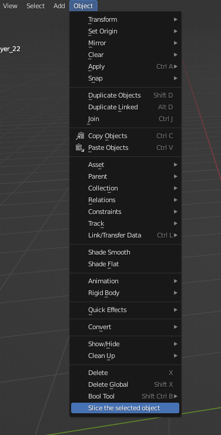
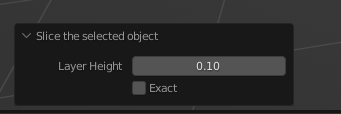
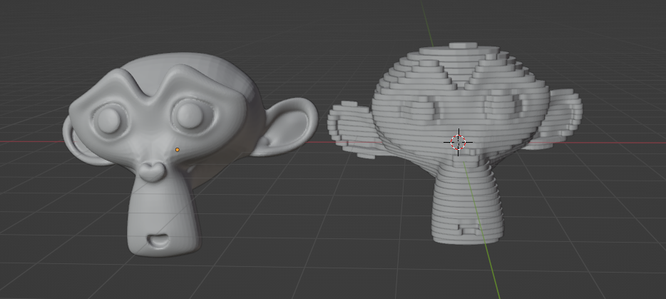
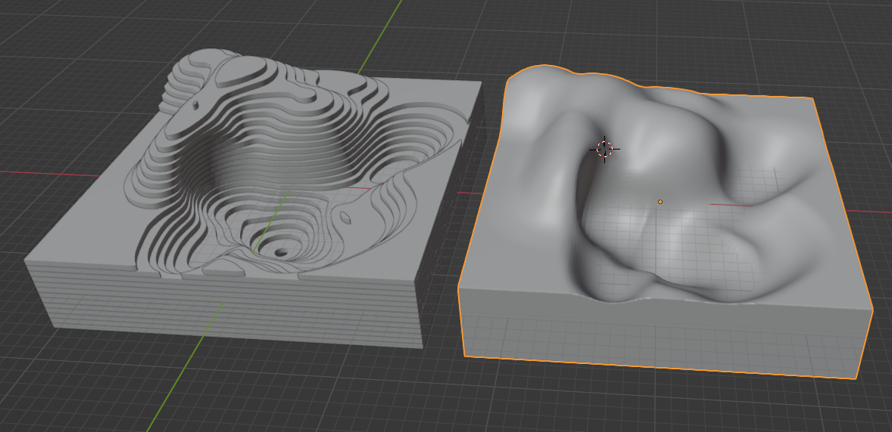
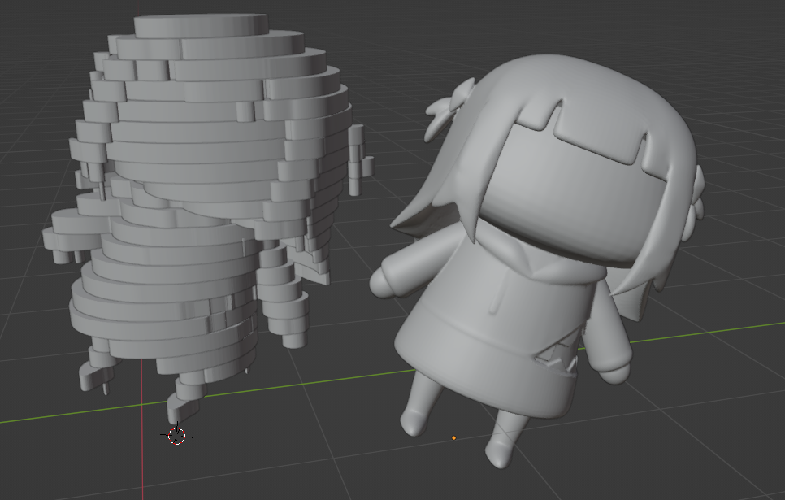

# blender_slicer_addon
A slicer addon for blender
The addon slices the selected object.

If no object is selected, it throws an error.

Because the addon uses the boolean modifier, it is slow and the addon can take a long time (or possibly crash blender) when used on a complex geometry (with a lot of vertices).

The geometry should be closed, if the addon is not working as intended, try remeshing your object and then applying the addon.
# Usage
To use it clone the repository (or download the .py file) and import it as an addon in blender.
Now, in the object tab there should be a button called 'Slice the selected object':

Just click it

Modify the layer height as you would like.
Checking the Exact box might make the final result more precise but it takes a longer time.

# Examples
Suzanne (Subdivided and Remeshed)

Some random shape

Smol Gura model (stolen from https://skfb.ly/o799I)
